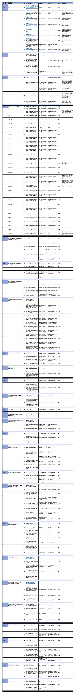

# Test Cases and Execution Report

A full downloadable excel document can be found [here](readme-images/test-results/test_results.xlsx).

Please note these results are a .xlsx file and will require excel, google docs, or a compatible program to open the file.

## **User Story Testing**

 
> As a **user**, I want to be able to navigate through the whole site smoothly.

Tests Covering story:
* TC008
* TC010
* TC011
* TCO12
* TC015

 

> As a **user**, I want to understand the purpose of the site upon loading it.

Tests Covering story:
* TC015

 

> As a **user**, I want the website to be responsive so that I can view the web pages 
  from my mobile, tablet, or desktop.

Tests Covering story:
* TCOO5
* TCOO6
* TC007

 

> As a **user**, I want to be able to return to the main site without having to use the browser buttons
  so that I can easily return to the website if I navigate to a page that does not exist.

Tests Covering story:
* TC008
* TC010
* TC011
* TCO12
* TC013
* TC014
* TC015

 

> As a **user**, I want to be able to contact the site owner.

Tests Covering story:
* TC009
* TC019

 

> As a **user**, I want to be able to view a list of products so that I can select some to purchase.

Tests Covering story:
* TC020 

 

> As a **user**, I want to be able to view individual product details so that I can identify the price, 
  description, and product image.

Tests Covering story:
* TC020 
* TC022 

 

> As a **user**, I want to be able to access a blog.

Tests Covering story:
* TC021 

 

### **Registration and User Account**
 

> As a **user**, I want to be able to easily register for an account so that I can have a 
  personal account and be able to view my profile.

Tests Covering story:
* TC017

 

> As a **user**, I want to be able to easily log in or log out so that I can access 
  my personal account information.

Tests Covering story:
* TC016
* TC018

 

> As a **user**, I want to be able to easily recover my password in case I forget it so 
  that I can recover access to my account.

Tests Covering story:
* TC016

 

> As a **user**, I want to be able to receive an email confirmation after registering so that 
  I can verify that my account registration was successful.

Tests Covering story:
* TC017

 

> As a **user**, I want to be able to have a personalized user profile so that I can view my 
  personal order history and order confirmation. 

Tests Covering story:
* TC008
* TC010
* TC011

 

### **Sorting and Searching**
 

> As a **user**, I want to be able to sort the list of available products so that I can easily 
  identify the best-priced and categorically sorted products.

Tests Covering story:
* TC020

 

> As a **user**, I want to be able to sort a specific category of product so that I can find the
  best-priced product in a specific category, or sort the products in that category by name.

Tests Covering story:
* TC020

 

> As a **user**, I want to be able to search for a product by name or description so that I can 
  find a specific product I would like to purchase.

Tests Covering story:
* TC020

 

> As a **user**, I want to be able to easily see what I have searched for and the number of results 
  so that I can quickly decide whether the product I want is available.

Tests Covering story:
* TC020

 

### **Purchasing and Checkout**
 

> As a **user**, I want to be able to easily select the quantity of a product when purchasing.

Tests Covering story:
* TC020
* TC022

 

> As a **user**, I want to be able to view items in my bag to be purchased.

Tests Covering story:
* TC022

 

> As a **user**, I want to be able to easily enter my payment information so that I can check out quickly.

Tests Covering story:
* TC023
* TC024
* TC025
* TC026

 

> As a **user**, I want to have my personal and payment information safe and secure.

Tests Covering story:
* TC023
* TC024
* TC025
* TC026

 

> As a **user**, I want to be able to view an order confirmation after checkout.

Tests Covering story:
* TC026

 

> As a **user**, I want to be able to receive an email confirmation after checking out with order confirmation. 

Tests Covering story:
* TC024
* TC026

 

### **Admin and Store Management**
 

> As a **site owner**, I want to be able to add products to the store.

Tests Covering story:
* TC020

 

> As a **site owner**, I want to be able to edit/update a product.

Tests Covering story:
* TC020

 

> As a **site owner** I want to be able to remove products.

Tests Covering story:
* TC020

 

> As a **site owner** I want to be able to edit/update a blog post.

Tests Covering story:
* TC021

 

> As a **site owner** I want to be able to delete a blog post

Tests Covering story:
* TC021

 

# Issues and Resolutions

## Console log: 
 

**Issue:**

Checked console for payment and getting:

1.Uncaught IntegrationError: Please call Stripe() with your publishable key. You used an empty string.
    at Yr ((index):1:186232)
    at new e ((index):1:254579)
    at dc ((index):1:284719)
    at stripe_elements.js:9:16

 

**Resolution:**
Removed the stripe_elements.js file on checkout_success template.

 

## Stripe & Email: 

**Issue:**
Issue not getting verification email or order confirmation email.

 

**Resolution:**
Removed DEVELOPMENT variable in Heroku.

 

**Issue:**
Issue not getting verification email or order confirmation email another time.

 

**Resolution:**
It was the gmail accounts app security that had been disabled. Went through the process of getting it restarted, and added new password to Heroku.

 

## Contact Form: 

**Issue:**
Not being automatically filled in with user info if they are logged in. 

 

**Resolution:**
Assistance from tutor support on this one, tried a couple of things before adding this to contact view: 

    if request.user.is_authenticated:
        contact_form = ContactForm(initial={
            'full_name': request.user.username,
            'email': request.user.email,
        })

 

## Footer: 

**Issue:**
Issue not getting the footer to stick to the bottom.

 

**Resolution:**
Added d-flex flex-column h-100 to body in htm customized from:
	https://radu.link/make-footer-stay-bottom-page-bootstrap/

And added a empty row and col to not let footer cover to much of the front-page.

 

## Quantity button 

**Issue:**
Being able to write in your own quantity and go beyond the limit. 

 

**Resolution:**
Added this to the quantity javascript:
$("[type='number']").keypress(function (evt) {
    evt.preventDefault();
});

